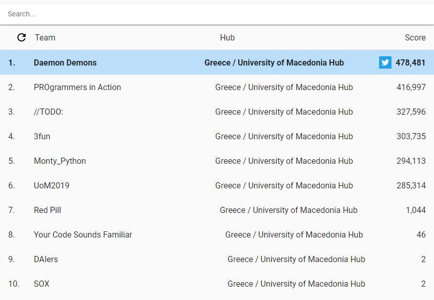
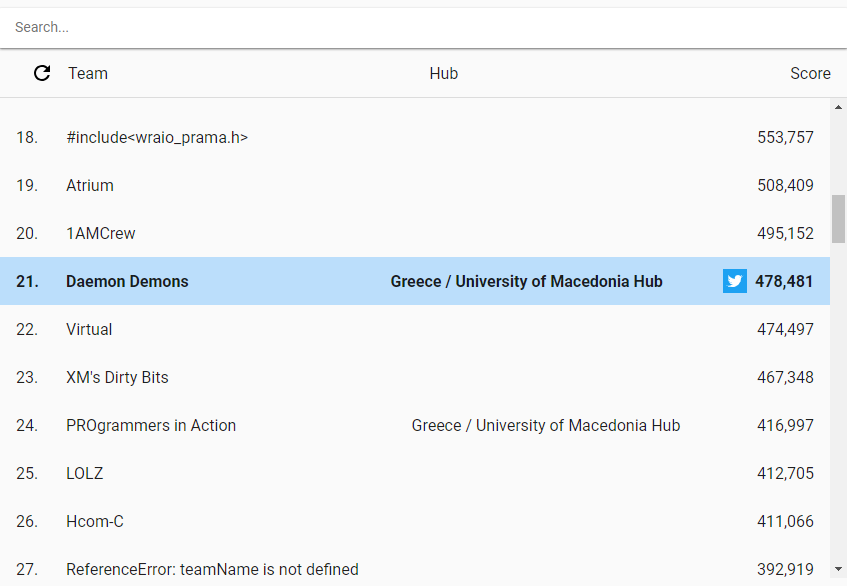

# Daemon Demons - Google Hash Code 2019

This repository contains the source code of the Google Hash Code qualifying round submission of the Daemon Demons team.

## About the team

The team was formed by three Greek Computer Science university freshmen from Thessaloniki:

* Georgios Basioukas (@GeorgiosBas) - Department of Applied Informatics, University of Macedonia
* John Tsenekidis (@PhantomXL) - Department of Computer Science, Aristotle University of Thessaloniki
* Theodore Tsirpanis (@teo-tsirpanis) - Department of Applied Informatics, University of Macedonia

We participated at the University of Macedonia hub.

## Technologies used

We wrote the solution in [F#](https://fsharp.org), a functional-first programming language [designed to encourage clean and correct code](http://fpbridge.co.uk).

Its rapid prototyping capabilities were exemplified by the fact that our first, 300k point graded submission was the first among the hub.

## Score

The team's final score was __478,481 points__. Specifically, we placed:

* __1st__ (out of 10) in our hub.
* __21st__ (out of 92) in Greece.
* __1607th__ (out of 6671) in the world.

